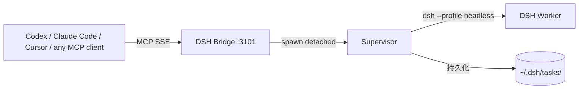

# dsh-codex-bridge

**DSH 插件 / MCP 服务器** — 让 Codex、Claude Code、Cursor 等 MCP 客户端将 DSH 当作外部可恢复子代理使用。



## Features

- **5 MCP tools**: `dsh_task_start`, `dsh_task_poll`, `dsh_task_cancel`, `dsh_task_list`, `dsh_get_status`
- **Async task model**: start returns immediately, poll for events via cursor
- **Resumable**: bridge restart recovers running tasks, orphans dead ones
- **Visual dashboard**: `http://127.0.0.1:3101/agents` — frosted glass UI
- **REST API**: full task management API
- **SSE stream**: real-time task events
- **Security**: bearer token, 127.0.0.1 only, cwd restriction

## Quick Start

```bash
# 1. Install as DSH plugin
dsh plugin --profile web add dsh-codex-bridge

# 2. Set token (optional, has dev default)
export DSH_CODEX_BRIDGE_TOKEN="your-32-char-token"

# 3. Start DSH
dsh web

# 4. Open dashboard
open http://127.0.0.1:3101/agents
```

## MCP Tools

| Tool | Description |
|------|-------------|
| `dsh_task_start` | Start an async task, returns taskId + dashboardUrl |
| `dsh_task_poll` | Read events incrementally by cursor (≤64 KiB) |
| `dsh_task_cancel` | Cancel a running task |
| `dsh_task_list` | List all tasks with status |
| `dsh_get_status` | Bridge health and stats |

### dsh_task_start parameters

| Parameter | Type | Required | Description |
|-----------|------|----------|-------------|
| `taskId` | string | yes | Idempotent request ID (same ID never starts twice) |
| `task` | string | yes | Task prompt for DSH headless |
| `cwd` | string | no | Working directory (must be whitelisted) |
| `timeoutMs` | number | no | Task timeout (default 300000, max 3600000) |
| `model` | string | no | Model ID override, e.g. `deepseek-v4-flash-0731`. Generated via `dsh --patch` overlay on `agent-default-model`; provider comes from your `settings.yaml`. |

Example: `{ "taskId": "t1", "task": "write a poem", "model": "deepseek-v4-flash-0731" }`

## State Machine

```
queued → running → succeeded
                 → failed
                 → timed_out
                 → cancelled
                 → orphaned
```

## Codex Configuration

```toml
[mcp_servers.dsh_agent]
url = "http://127.0.0.1:3101/sse"
bearer_token_env_var = "DSH_CODEX_BRIDGE_TOKEN"
startup_timeout_sec = 10
tool_timeout_sec = 45
enabled_tools = [
  "dsh_task_start",
  "dsh_task_poll",
  "dsh_task_cancel",
  "dsh_task_list",
  "dsh_get_status"
]
```

## API Endpoints

| Method | Path | Description |
|--------|------|-------------|
| GET | `/api/agents/tasks` | List tasks |
| GET | `/api/agents/tasks/:taskId` | Task detail |
| POST | `/api/agents/tasks` | Create task |
| POST | `/api/agents/tasks/:taskId/cancel` | Cancel task |
| POST | `/api/agents/tasks/:taskId/retry` | Retry task |
| GET | `/api/agents/tasks/:taskId/events` | Get events (cursor) |
| GET | `/api/agents/tasks/:taskId/files/:file` | Download artifact |
| GET | `/api/agents/stream` | SSE event stream |

## Dashboard

The dashboard at `http://127.0.0.1:3101/agents` provides:

- **Left panel**: task list with status filter
- **Center**: real-time event stream (stdout/stderr/status)
- **Right panel**: task details (PID, timing, artifacts)
- **Dark/light mode**: follows system preference

## Architecture

```
dsh-codex-bridge/
├── lib/
│   ├── index.js          DSH plugin entry + MCP server + REST API
│   ├── dashboard.html    Visual dashboard (single-file HTML/CSS/JS)
│   └── supervisor.mjs    Detached supervisor process
├── package.json
├── cordis.patch.yml
└── LICENSE
```

## License

MIT

## Community

Discussion & endorsement: [Linux DO](https://linux.do)